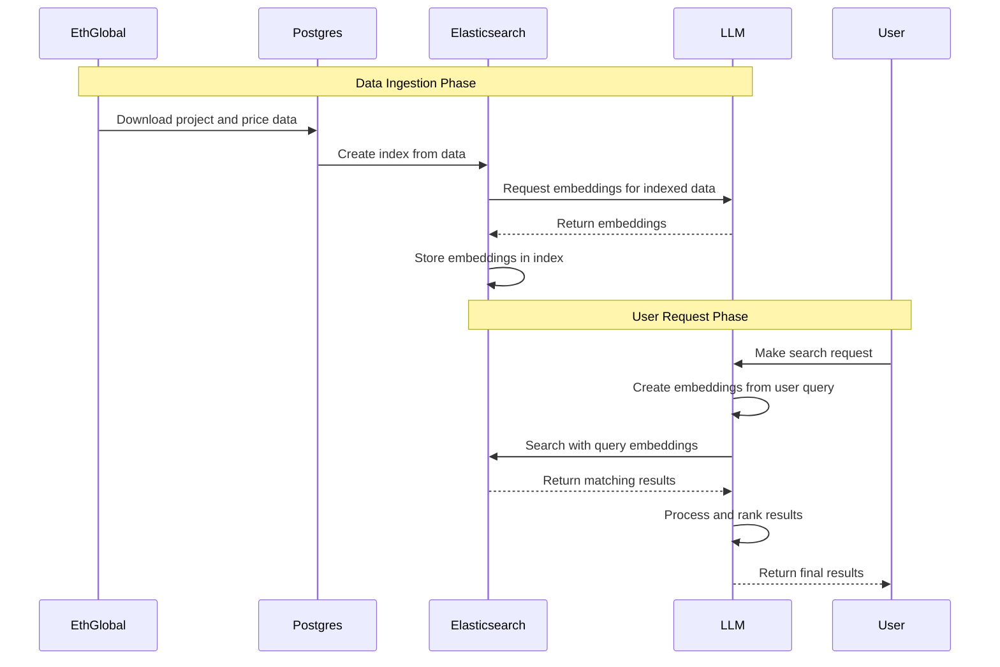

# ETHSearch
A better way to search and explore EthGlobal showcase projects.

## Description
Born out of a frustration of our inability to adequately search and find showcase projects, EthSearch is an easier, better way to search EthGlobal showcase projects.

This project scrapes data off the EthGlobal showcase website and uses OG compute processes to rank the results, enabling users to search and filter for: projects that have previously won hackathons, protocols integrated, and by geolocation of the hackathon. We have also optimized the searching process to enable a faster searching experience.

## Technical
The system downloads project and price data from EthGlobal into Postgres, then indexes it in Elasticsearch. The LLM generates embeddings for the indexed data, which Elasticsearch stores.

For user searches, the LLM embeds the query, Elasticsearch finds similar items, and 0G compute processes and ranks the results. Regular searches and graph data use standard Elasticsearch, while Postgres provides structured details such as links and related project information.

