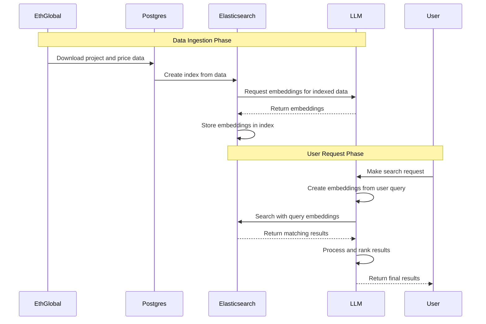

# ETHSearch

short stuff

## Description

## Technical
The system downloads project and price data from EthGlobal into Postgres, then indexes it in Elasticsearch. The LLM generates embeddings for the indexed data, which Elasticsearch stores.

For user searches, the LLM embeds the query, Elasticsearch finds similar items, and 0G compute processes and ranks the results. Regular searches and graph data use standard Elasticsearch, while Postgres provides structured details such as links and related project information.

